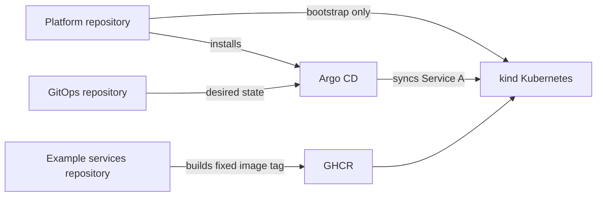

# Golden Path Deployment Platform

Small SaaS teams often have application code but no repeatable path from an
empty local machine to a declaratively deployed service. This repository
provides that minimum platform path for v0.1.0: a kind cluster, Argo CD
bootstrap, and a GitOps-managed example service.

**Current implementation progress: COMPLETE V0.1.0 RUNTIME WORKFLOW VERIFIED
ON LOCAL KIND.** Fresh creation, destruction, absence confirmation, and rebuild with
the repository scripts succeeded; the rebuilt control-plane reached `Ready`.
Evidence is recorded in
[`bootstrap-result.txt`](evidence/releases/v0.1.0/bootstrap-result.txt) and
[`rebuild-result.txt`](evidence/releases/v0.1.0/rebuild-result.txt). Argo CD
Bootstrap and the Root Application have also been runtime verified. Argo CD
recognized `root-applications` as `Synced` and `Healthy`; its frozen source
automatically created a `service-a` child Application and a Service A workload
was observed. Service A runtime verification now confirms the Application is
`Synced`/`Healthy`, its Deployment and Pod are Ready, its Service has an active
endpoint, and its expected JSON response is reachable through temporary
port-forwarding. The full destroy/rebuild workflow has also been runtime
verified with the repository scripts and GitOps reconciliation path. This is
not a production-ready platform.

## Golden Path

In v0.1.0, the Golden Path is the single deployment procedure officially
supported by the Platform Team. It is the default route for developers to
deploy Service A safely and consistently: GitOps desired state is reconciled
by Argo CD instead of developers directly applying application resources to
Kubernetes.

## Target users

Small SaaS development teams evaluating a minimal local Kubernetes and GitOps foundation.

## Architecture



## Repository responsibilities

| Repository | Responsibility |
| --- | --- |
| `golden-path-deployment-platform` | Bootstrap, verification, documentation |
| `golden-path-gitops` | Kubernetes desired state and Kustomize overlays |
| `golden-path-example-services` | Service A code, image build, and CI |

## Prerequisites

Docker daemon, kind, kubectl (including `kubectl kustomize`), make, and git
are required. ShellCheck, yamllint, and kubeconform are optional locally and
report explicit skips when absent.

## Configuration

Platform values are centralized in
[`config/platform.env.example`](config/platform.env.example). Its default
GitOps URL targets the `main` branch. The GitOps repository must be public in
v0.1.0. No credentials are configured automatically.

## Quick start

```bash
cp config/platform.env.example config/platform.env.local
make prerequisites
./bootstrap/kind/create-cluster.sh
./bootstrap/argocd/install.sh
./bootstrap/argocd/apply-root-application.sh
./scripts/verify-platform.sh
../golden-path-gitops/scripts/validate.sh
```

The GitOps repository must first be available as the configured public remote.
Service A is never directly applied by Platform scripts; the Root Application
points Argo CD to the GitOps repository. Use
`./bootstrap/destroy.sh` before repeating the full rebuild sequence.

## Verification and rebuild

The v0.1.0 Runtime Verification completed successfully on local kind:

- `make bootstrap` creates the cluster, installs Argo CD, and applies the
  Root Application.
- Root Application and Service A Application reach `Synced` and `Healthy`.
- Service A reaches one available replica with a Ready Pod.
- `make service-a-check` returns the expected JSON response.
- `make destroy`, followed by `make bootstrap`, reproduces the same
  successful state.

The recorded command results are versioned in
[`evidence/releases/v0.1.0`](evidence/releases/v0.1.0). Run the full rebuild
sequence in [the rebuild runbook](runbooks/platform-rebuild.md).

## Success criteria

The following v0.1.0 success criteria are verified in the recorded runtime
evidence:

- Bootstrap creates the kind cluster and installs Argo CD successfully.
- GitOps desired state deploys Service A through Argo CD.
- The Root Application is `Synced` and `Healthy`.
- The Service A Application is `Synced` and `Healthy`, with an available
  Deployment and a Ready Pod.
- Service A returns the expected HTTP response.
- Service A is deployed by Argo CD without a direct `kubectl apply` of its
  application manifests.
- Destroy and rebuild recreate the same healthy state.
- Full Runtime Verification is complete and its evidence is recorded in Git.

## Known limitations

v0.1.0 is a local kind foundation with one public GitOps repository, one dev
Service A deployment, and manual fixed-image updates. Private Git repository
authentication, automated image updates, cloud infrastructure, monitoring,
rollback automation, and multi-cluster operation remain out of scope.

## Scope and non-goals

v0.1.0 includes one dev service, kind, Argo CD, Kustomize, automation, and
verification. It excludes Service B, stage, image-update automation,
automated PRs, Terraform, AWS/EKS, monitoring, HPA, NetworkPolicy, secrets
management, multi-cluster, databases, authentication, APIs, and AI features.

## Version strategy and documentation

See [version strategy](docs/version-strategy.md), [docs](docs), and
[known limitations](evidence/releases/v0.1.0/known-limitations.md).
