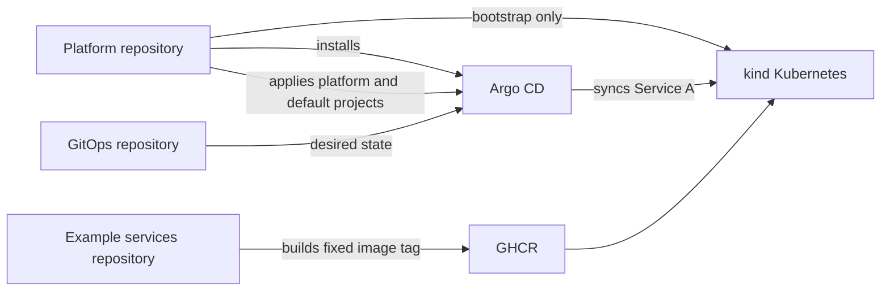

# Golden Path Deployment Platform

Small SaaS teams often have application code but no repeatable path from an
empty local machine to a declaratively deployed service. This repository
provides that minimum platform path: a kind cluster, Argo CD bootstrap, and a
GitOps-managed example service.

**Runtime baseline: v0.1.1 release-input verification completed on local
kind.** The verified workflow pins the kind node image,
Argo CD v3.4.5 manifest and checksum, GitOps `v0.1.1` tag, and Service A OCI
digest. Fresh creation, destruction, absence confirmation, and rebuild reached
the same healthy release identities and HTTP response. This is not a
production-ready platform.

**GP-2A v0.2.0 is released and runtime-verified.** Dedicated Argo CD
AppProjects constrain the root and Service A Applications, and the permissive
default project is restricted.

**GP-3 v0.3.0 is released and runtime-verified.** The workload security
baseline, platform-owned tokenless ServiceAccount, and Restricted Pod Security
Admission enforcement were observed in a disposable runtime.

**GP-4 v0.4.0 is released and runtime-verified.** ResourceQuota, LimitRange,
positive workload admission, isolated quota denials, and replica behavior were
observed in a disposable runtime.

**GP-5 v0.5.0 and SC-1 are released.** Existing semantic contracts remain
separate, while GitOps and Platform expose fail-closed CI entrypoints. SC-1
pins the approved CI supply-chain inputs and establishes Service repository
governance.

**GP-6 v0.6.0 is at the Platform release-candidate review gate.** The
candidate pins the finalized GitOps v0.6.0 annotated-tag identity and records
the narrow ValidatingAdmissionPolicy contract in Warn/Audit mode. GP-6 is
SOURCE-CONFIRMED and TEST-VERIFIED, but NOT RUNTIME-VERIFIED; Deny is not
enabled.

## Golden Path

In v0.1.0, the Golden Path is the single deployment procedure officially
supported by the Platform Team. It is the default route for developers to
deploy Service A safely and consistently: GitOps desired state is reconciled
by Argo CD instead of developers directly applying application resources to
Kubernetes. Automated Git changes are reconciled, but live drift is not
automatically corrected because `selfHeal` remains disabled.

## Target users

Small SaaS development teams evaluating a minimal local Kubernetes and GitOps
foundation.

## Architecture


```mermaid
flowchart LR
  P[Platform repository] -->|bootstrap only| K[kind Kubernetes]
  P -->|installs| A[Argo CD]
  P -->|applies platform and default projects| A
  G[GitOps repository] -->|desired state| A
  A -->|syncs Service A| K
  E[Example services repository] -->|builds fixed image tag| R[GHCR]
  R --> K
```

## Repository responsibilities

| Repository | Responsibility |
| --- | --- |
| `golden-path-deployment-platform` | Bootstrap, verification, documentation |
| `golden-path-gitops` | Kubernetes desired state and Kustomize overlays |
| `golden-path-example-services` | Service A code, image build, and CI |

## Prerequisites

Docker daemon, kind, kubectl (including `kubectl kustomize`), make, and git
are required. ShellCheck, yamllint, and kubeconform are optional locally and
report explicit skips when absent.

## Configuration

Platform values are centralized in
[`config/platform.env.example`](config/platform.env.example). It targets the
finalized GitOps `v0.6.0` release for the Platform GP-6 release candidate. The
candidate input set is recorded in
[`v0.6.0-release-manifest.yaml`](releases/v0.6.0-release-manifest.yaml). The
released v0.5.0 input set is recorded in
[`v0.5.0-release-manifest.yaml`](releases/v0.5.0-release-manifest.yaml), the
released v0.4.0 input set is recorded in
[`v0.4.0-release-manifest.yaml`](releases/v0.4.0-release-manifest.yaml), the
released v0.3.0 input set is recorded in
[`v0.3.0-release-manifest.yaml`](releases/v0.3.0-release-manifest.yaml), the
released v0.2.0 input set is recorded in
[`v0.2.0-release-manifest.yaml`](releases/v0.2.0-release-manifest.yaml), while
the historical v0.1.1 input set is recorded in
[`v0.1.1-release-manifest.yaml`](releases/v0.1.1-release-manifest.yaml). No
external repository or registry credentials are configured automatically.

## Quick start

```bash
cp config/platform.env.example config/platform.env.local
make prerequisites
./bootstrap/kind/create-cluster.sh
./bootstrap/argocd/install.sh
./bootstrap/argocd/apply-platform-projects.sh
./bootstrap/argocd/apply-root-application.sh
./scripts/verify-platform.sh
../golden-path-gitops/scripts/validate.sh
```

The GitOps repository must first be available as the configured public remote.
Service A is never directly applied by Platform scripts; the Root Application
points Argo CD to the GitOps repository. Use
`./bootstrap/destroy.sh` before repeating the full rebuild sequence.

## GP-2A trust boundary

Service A is constrained by a dedicated Argo CD AppProject to the approved
GitOps repository, the `dev` namespace, and Deployment, Service, and ConfigMap
desired resources. This boundary is SOURCE-CONFIRMED, TEST-VERIFIED, and
RUNTIME-VERIFIED. The Argo application-controller remains a cluster-wide,
high-trust component, and this platform is not described as multi-tenant. See
[the GP-2A trust-boundary record](docs/gp-2a-trust-boundary.md).

## GP-3 workload security boundary

GP-3 adds a hardened Service A Pod specification, a platform-owned tokenless
ServiceAccount, and Kubernetes v1.36 Restricted Pod Security Admission on
Namespace `dev`. Static contract tests cover the allowed manifest and fifteen
forbidden mutations. This state is `SOURCE-CONFIRMED`, `TEST-VERIFIED`, and
`RUNTIME-VERIFIED`. See
[the GP-3 workload-security record](docs/gp-3-workload-security.md).

## GP-4 resource governance boundary

GP-4 adds a platform-owned ResourceQuota and LimitRange to Namespace `dev`,
managed by a dedicated AppProject/Application that can reconcile only those
two kinds. Static contract tests verify the exact namespace budget, per-
container maxima, workload fit, rolling-update surge fit, and eight forbidden
mutations. This state is `SOURCE-CONFIRMED`, `TEST-VERIFIED`, and
`RUNTIME-VERIFIED`. The exact released contract is recorded in the
[`v0.4.0` release manifest](releases/v0.4.0-release-manifest.yaml).

## GP-5 CI contract

GitOps keeps `scripts/validate.sh` as its required-check entrypoint. Platform
uses `make ci` to run linting, trust and release contracts, and read-only
remote GitOps tag verification. The check names remain `validate` and
`static-validation`; GitHub governance is unchanged. See
[the GP-5 CI contract](docs/gp-5-ci-contract.md). The exact release candidate
identity and GP-5 evidence classification are recorded in the
[`v0.5.0` release manifest](releases/v0.5.0-release-manifest.yaml).

## GP-6 admission contract

GitOps defines a platform-owned ValidatingAdmissionPolicy and binding for the
`dev` namespace. The initial binding uses Warn and Audit only; Deny is not
enabled. Platform records the finalized GitOps identity and the static GP-6
evidence without claiming Kubernetes admission behavior. GP-6 is
`SOURCE-CONFIRMED`, `TEST-VERIFIED`, and `NOT RUNTIME-VERIFIED`. The exact
release-candidate identity is recorded in the
[`v0.6.0` release manifest](releases/v0.6.0-release-manifest.yaml).

## Verification and rebuild

The v0.1.1 Runtime Verification completed successfully on local kind:

- `make bootstrap` creates the cluster, installs Argo CD, and applies the
  Root Application.
- Root Application and Service A Application reach `Synced` and `Healthy`.
- Service A reaches one available replica with a Ready Pod.
- `make service-a-check` returns the expected JSON response.
- `make destroy`, followed by `make bootstrap`, reproduces the same
  successful state.
- The verifier confirms the pinned kind image, Argo CD version, GitOps
  revision for both Applications, Service A OCI imageID, and a ready
  EndpointSlice endpoint.

The recorded command results are versioned in
[`evidence/releases/v0.1.1`](evidence/releases/v0.1.1). Run the full rebuild
sequence in [the rebuild runbook](runbooks/platform-rebuild.md).

## Success criteria

The following v0.1.1 success criteria are verified in the recorded runtime
evidence:

- Bootstrap creates the kind cluster and installs Argo CD successfully.
- GitOps desired state deploys Service A through Argo CD.
- The Root Application is `Synced` and `Healthy`.
- The Service A Application is `Synced` and `Healthy`, with an available
  Deployment and a Ready Pod.
- Service A returns the expected HTTP response.
- Service A is deployed by Argo CD without a direct `kubectl apply` of its
  application manifests.
- Destroy and rebuild recreate the same healthy state.
- Both runs use the same pinned kind image, Argo CD manifest checksum, GitOps
  release tag, and Service A OCI digest.
- Full Runtime Verification is complete and its evidence is recorded in Git.

## Known limitations

The platform is a local kind foundation with one public GitOps repository, one dev
Service A deployment, and manual fixed-image updates. Private Git repository
authentication, automated image updates, cloud infrastructure, monitoring,
rollback automation, and multi-cluster operation remain out of scope.

## Scope and non-goals

v0.1.0 includes one dev service, kind, Argo CD, Kustomize, automation, and
verification. It excludes Service B, stage, image-update automation,
automated PRs, Terraform, AWS/EKS, monitoring, HPA, NetworkPolicy, secrets
management, multi-cluster, databases, authentication, APIs, and AI features.

## Version strategy and documentation

See [version strategy](docs/version-strategy.md), [docs](docs), and
[known limitations](evidence/releases/v0.1.0/known-limitations.md).
