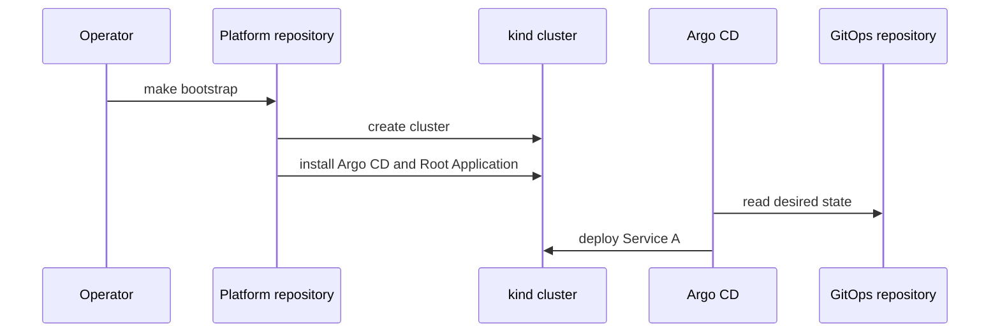

# Architecture

Platform creates the kind cluster and installs Argo CD using the official stable manifest. It directly applies only the Argo CD installation and Root Application. The Root Application reads `applications/root` from the public GitOps repository. Argo CD then creates the Service A Application, which deploys the Kustomize dev overlay.

The trust boundary is explicit: the public GitOps URL supplies desired state; private-repository authentication is out of scope. Application image publishing is separate from desired-state changes.
