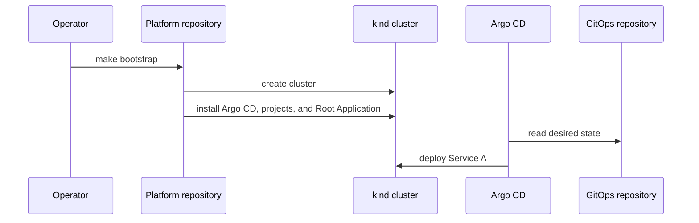

# Architecture

Platform creates the kind cluster and installs Argo CD using the pinned
official manifest. It directly applies the Argo CD installation, the narrow
`golden-path-platform` AppProject, the deny-all configuration for the existing
`default` project, and the Root Application. The Root Application reads
`applications/root` from the public GitOps repository. It owns the Service A
workload, identity, and resource-governance AppProjects, Namespace `dev`, and
their Applications.
The identity Application manages only `ServiceAccount/service-a`. The workload
Application deploys only its Deployment, Service, and ConfigMap. The governance
Application manages only ResourceQuota and LimitRange in `dev`.

## Developer experience

For developers, the supported path is Developer -> Golden Path Platform ->
GitOps -> Argo CD -> Kubernetes -> Application. Developers express a
deployment change as GitOps desired state instead of directly operating
Kubernetes application resources; Argo CD performs the reconciliation.

```mermaid
sequenceDiagram
  participant U as Operator
  participant P as Platform repository
  participant K as kind cluster
  participant A as Argo CD
  participant G as GitOps repository
  U->>P: make bootstrap
  P->>K: create cluster
  P->>K: install Argo CD, projects, and Root Application
  A->>G: read desired state
  A->>K: deploy Service A
```

The Service A AppProject restricts its source to the exact public GitOps URL,
its destination to in-cluster `dev`, and its desired resource kinds to
Deployment, Service, and ConfigMap. The separate identity AppProject permits
only ServiceAccount in `dev`, preserving the workload boundary. The governance
AppProject permits only ResourceQuota and LimitRange in `dev` and has no
cluster-resource authority. GP-2A Argo enforcement and GP-3 pod-security and
identity controls are `RUNTIME-VERIFIED`. GP-4 resource governance is
`SOURCE-CONFIRMED` and `TEST-VERIFIED`, but `NOT RUNTIME-VERIFIED`.

Namespace `dev` selects the Kubernetes v1.36 Restricted Pod Security Standard.
Service A declares non-root execution, RuntimeDefault seccomp, no privilege
escalation, no Linux capabilities, a read-only root filesystem, and no
automatic ServiceAccount token. These controls do not restrict the
cluster-wide Argo controller identity. Private-repository authentication and
application image publishing remain separate concerns.
