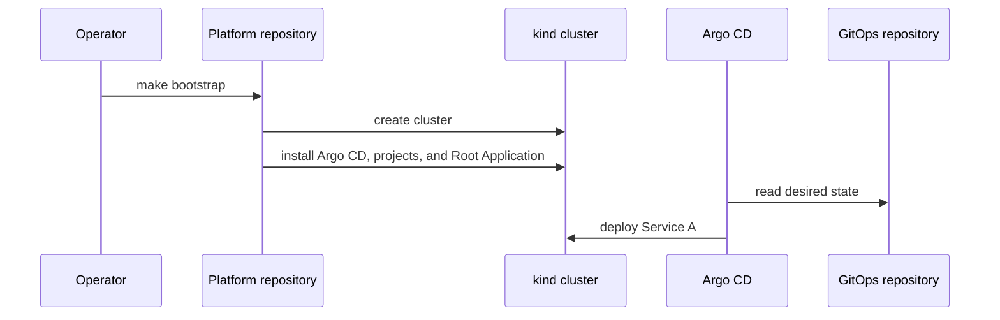

# Architecture

Platform creates the kind cluster and installs Argo CD using the pinned
official manifest. It directly applies the Argo CD installation, the narrow
`golden-path-platform` AppProject, the deny-all configuration for the existing
`default` project, and the Root Application. The Root Application reads
`applications/root` from the public GitOps repository. It owns the Service A
workload AppProject, Namespace `dev`, and the Service A Application. Service A
then deploys only its Deployment, Service, and ConfigMap.

## Developer experience

For developers, the supported path is Developer -> Golden Path Platform ->
GitOps -> Argo CD -> Kubernetes -> Application. Developers express a
deployment change as GitOps desired state instead of directly operating
Kubernetes application resources; Argo CD performs the reconciliation.

```mermaid
sequenceDiagram
  participant U as Operator
  participant P as Platform repository
  participant K as kind cluster
  participant A as Argo CD
  participant G as GitOps repository
  U->>P: make bootstrap
  P->>K: create cluster
  P->>K: install Argo CD, projects, and Root Application
  A->>G: read desired state
  A->>K: deploy Service A
```

The Service A AppProject restricts its source to the exact public GitOps URL,
its destination to in-cluster `dev`, and its desired resource kinds to
Deployment, Service, and ConfigMap. This source/test-confirmed boundary does not
restrict the cluster-wide Argo controller identity and has not yet been runtime
verified. Private-repository authentication is out of scope. Application image
publishing is separate from desired-state changes.
