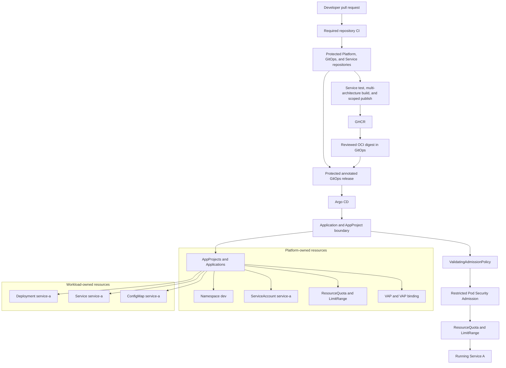

# Golden Path architecture and trust boundaries

## Delivery and enforcement flow


```mermaid
flowchart TD
  D[Developer pull request] --> C[Required repository CI]
  C --> R[Protected Platform, GitOps, and Service repositories]
  R --> B[Service test, multi-architecture build, and scoped publish]
  B --> H[GHCR]
  H --> I[Reviewed OCI digest in GitOps]
  R --> T[Protected annotated GitOps release]
  I --> T
  T --> A[Argo CD]
  A --> P[Application and AppProject boundary]
  P --> V[ValidatingAdmissionPolicy]
  V --> S[Restricted Pod Security Admission]
  S --> Q[ResourceQuota and LimitRange]
  Q --> W[Running Service A]

  subgraph Platform-owned resources
    N[Namespace dev]
    AP[AppProjects and Applications]
    SA[ServiceAccount service-a]
    RG[ResourceQuota and LimitRange]
    VA[VAP and VAP binding]
  end

  subgraph Workload-owned resources
    DP[Deployment service-a]
    SV[Service service-a]
    CM[ConfigMap service-a]
  end

  P --> AP
  AP --> N
  AP --> SA
  AP --> RG
  AP --> VA
  AP --> DP
  AP --> SV
  AP --> CM
```

The Platform repository creates the disposable kind cluster, verifies the
pinned Argo CD manifest, applies the narrow bootstrap project, locks down the
existing `default` project, and applies the Root Application. Argo then reads
protected GitOps desired state. Service A is never directly applied by the
Platform bootstrap.

## Application ownership graph

```text
golden-path-platform
├── AppProject/golden-path-service-a
├── AppProject/golden-path-service-a-identity
├── AppProject/golden-path-dev-governance
├── AppProject/golden-path-dev-admission
├── Namespace/dev
├── Application/service-a-identity
│   └── ServiceAccount/service-a
├── Application/dev-resource-governance
│   ├── ResourceQuota/dev-resource-budget
│   └── LimitRange/dev-container-boundary
├── Application/dev-admission
│   ├── ValidatingAdmissionPolicy/golden-path-deployment-contract
│   └── ValidatingAdmissionPolicyBinding/
│       golden-path-deployment-contract-dev
└── Application/service-a
    ├── Deployment/service-a
    ├── Service/service-a
    └── ConfigMap/service-a
```

The platform-owned root project has the cluster-resource permissions needed to
manage AppProjects, Applications, Namespace `dev`, and the dedicated admission
project's two cluster-scoped policy kinds. It does not give those permissions
to the workload project.

## Enforcement ownership

- **GitHub rulesets and CI** own the reviewed-change and test gates.
- **SC-1 build controls** own Action, tool, schema, and Docker base pinning and
  isolate image publication permission.
- **Argo CD AppProjects** own repository, destination, and allowed-kind
  boundaries.
- **Restricted PSA** owns standardized Pod privilege, host access, non-root,
  seccomp, and capability requirements.
- **ResourceQuota** owns aggregate Namespace `dev` budgets.
- **LimitRange** owns per-container CPU and memory maxima.
- **GP-6 VAP** owns the Deployment-specific image, ServiceAccount, token,
  read-only filesystem, probe, resource-presence, and replica contracts.
- **GitOps desired state** owns the exact workload image digest and declared
  Service A resources.

The released GP-6 binding is `Warn/Audit`. Temporary `Deny/Audit` behavior was
runtime-observed but is not the released enforcement state.

## Evidence state

- GP-2A AppProject behavior: `RUNTIME-VERIFIED`.
- GP-3 workload security and PSA: `RUNTIME-VERIFIED`.
- GP-4 quota and LimitRange behavior: `RUNTIME-VERIFIED`.
- GP-5 CI contracts: `TEST-VERIFIED` and `RELEASED`.
- SC-1 supply-chain foundation: `TEST-VERIFIED` and `RELEASED`.
- GP-6 corrected CEL: `TEST-VERIFIED`, type-check clean, and released as
  GitOps `v0.6.1`.
- GP-6 Warn/Audit: `RUNTIME-VERIFIED`.
- GP-6 Deny/Audit: `TEMPORARY RUNTIME OBSERVATION`, not released.

See [security evidence](security-evidence.md) and the
[security threat model](security-threat-model.md) for the exact evidence and
residual risks.
